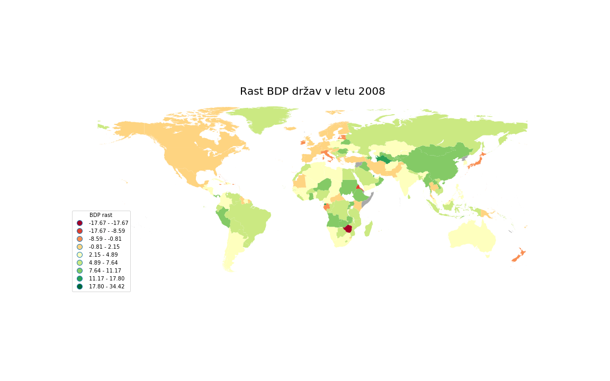
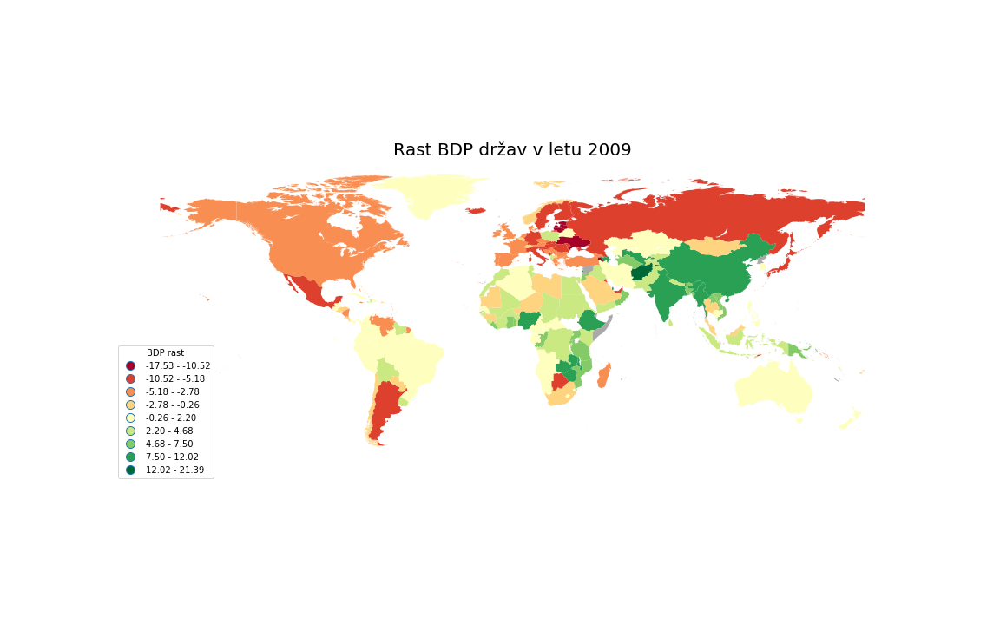
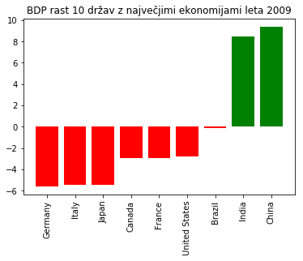
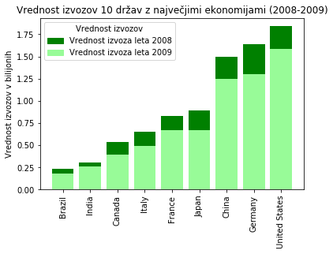
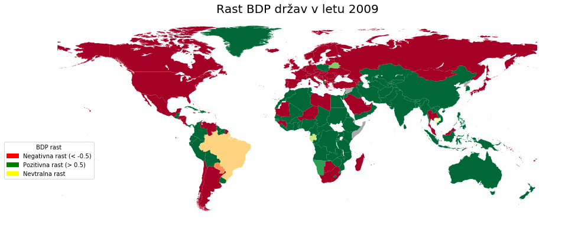
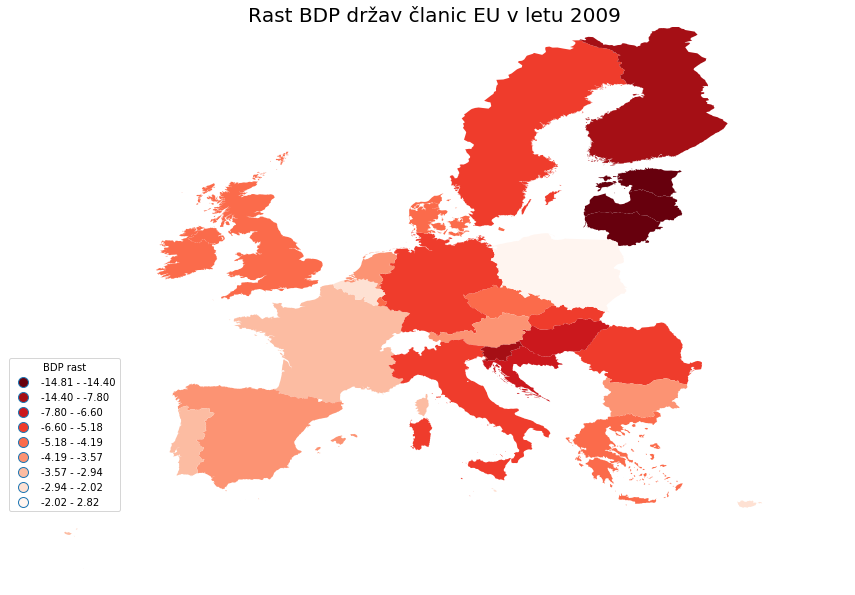
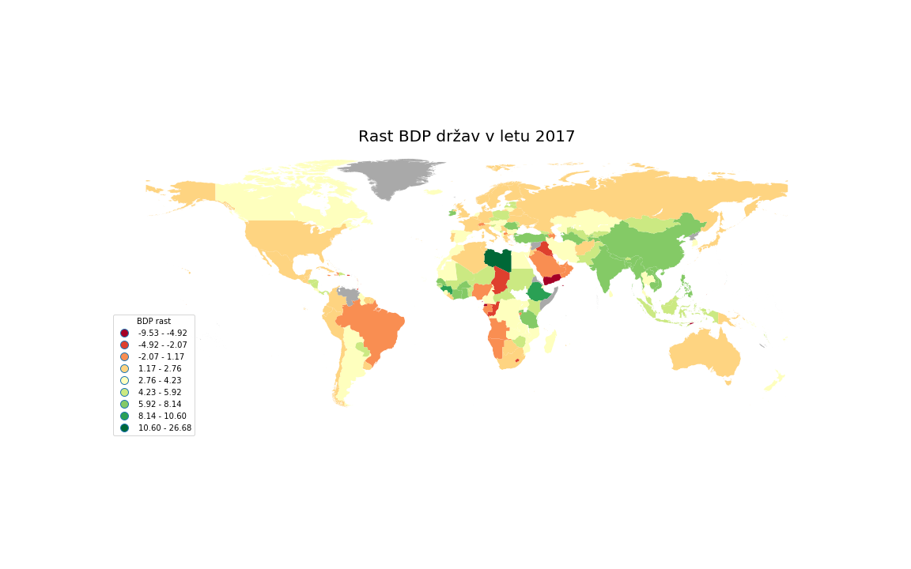
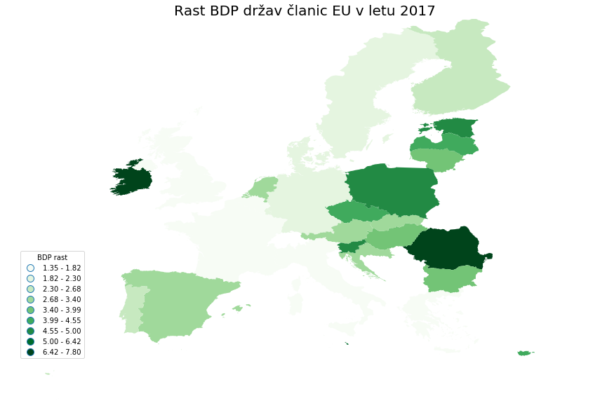

# Napovednik recesije
V današnjem globalnem svetu je neprestana gospodarska rast in ekonimičen napredek potrebna za vzdrževanje našega vsakdanjega
življenja. Kaj pa se zgodi, ko nastane kriza v sistemu? Nenadoma se pojavi velika brezposelnost, pomankanje posla za podjetja
ter izguba zaupanja investitorjev v trg in s tem manjše investicije. Te krize imajo velik upliv na naše vsakdanje življenje in
pogled na prihodnost zato bi bilo dobro vedeti, če jo lahko napovemo, da bi se tako morda bolje pripravili nanjo oz. še bolje
napovedali kje bodo nastale težave iz katerih se bo razvila naslednja kriza.

Cilj tega projekta je ugotoviti, če se da napovedati recesije na podlagi podatkov iz prejšnjih let in če obstajajo očitni
znaki, da smo pred njenim pragom. Opazovali bi tudi kako tesno so povezani naši trgi z svetovnimi in kako na nas vplivajo krize
v drugih državah ter ali se res svetovna gospodarska rast upočasnjuje.

## Podatki
Podatke bom primarno vzel iz https://data.worldbank.org/.

Podatki o:
* BDP-ju držav: https://data.worldbank.org/indicator/NY.GDP.MKTP.CD
* Vrednosti izvozov: https://data.worldbank.org/indicator/bx.gsr.gnfs.cd
* Vrednosti uvozov: https://data.worldbank.org/indicator/NE.IMP.GNFS.CD
* Vrednosti investicij: https://data.worldbank.org/indicator/BX.KLT.DINV.CD.WD

Podatki predstavljajo vrednosti za vsako državo v ameriških dolarjih ter so v formatu `.csv`.

V projektu bom tudi vzel pomembnejše dogodke, ki so vplivali na svetoven trg (2007 Kriza hišnega trga v ZDA, 2016 Brexit, 2009 Grška finančna kriza itd.)

---

## Analiza globalne finančne krize leta 2008

Poročilo bom začel z začetno analizo globalne finančne krize leta 2008, saj je ta najbolj povdarna "svetovna" kriza, ki je imela velik vpliv na veliko večino prebivalstva. Beseda "svetovna" je namenoma podana v narekovajih ker ta kriza ni vplivala na vse trge/regije po svetu, ampak primarno samo na zahodne trge, ker pa so te tako veliki in vplivni pa hitro potegnemo črto na "svetovno" krizo.

Mapa rasti BDP-ja v letu 2008 nam presenetljivo ne da občutka, da je sploh kaj narobe. Res vidimo da se je rast zahodnih ekonomij upočasnila, kar pa se ne zdi prav glede na katastrofalen učinek, ki ga je imela. Bolj zanimive podatke dobimo, ko pogledamo zemljevid za leto 2009.

Tukaj vidimo kako kako močno se je gospodarstvo skrčilo leto po napovedu krize. Vidi se tudi kako so države, ki bolj povezani z zahodnim trgom, res najbolj občutile to krizo. Druge velike ekonomije kot so Kitajska in Indija pa  so močno rastle.

Sedaj lahko poskusimo odkriti, če obstajata 2 skupini držav, ki imajo med seboj bolj povezana gospodarstva. Za to bom uporabil KMeans gručenje in ga nastavil, da naj razdeli podatke v 2 skupini.
.png)
Na sliki je središče vsake gruče označeno z rumenimi krogom. Kot vidimo iz grafa naše KMeans gručenje ni bilo uspešno saj sta 2 gruči zelo blizu in ne nakazujeta na neki dve skupini držav.

Kaj pa če bi poskusili pogledati gospodarsko rast na stolpičnem grafu? Tako bi se lepo videlo katerim državam je gospodarska rast padala oz. naraščala. Ker je na svetu držav zelo veliko (prb. 248) bi zadoščevalo, da bi prikazali le prvih 10 držav z največjimi gospodarstvi, saj so dobra napovedniki kakšne so gospodarske razmere v njihovi trgovski skupini.
<p align="center">
  
</p>
Tukaj bolje vidimo kako je ta kriza vplivala na največja gospodarstva na svetu. Naš sklep ostane isti saj vidimo da je to krizo najbolj občutil zahodni svet.

Kako pa je kriza vplivala na vrednost izvozov v teh državah?
<p align="center">
  
</p>
Tukaj vidimo kako je večini držav enakomerno padla vrednost izvozov, kar pa kaže na vsesplošno povezanost svetovnih trgov.

Še zadnja slika, ki na zemljevidu enobarvno prikazuje katerim državam je gospodarstvo rastlo med krizo in katerim je padalo.


---

## Analiza gospodarskega stanja v evropski uniji med grško finančno krizo

Sedaj si podrobno poglejmo kakšna je bilo gospodarsko stanje članic evropske unije med grško finančno krizo, ki se je začela med recesijo leta 2009.

Nepresenetljivo vidimo, kako je bila praktično vsa evropa že globoko v krizi, ko se je grška finančna kriza začela. Morda se je gospodarstvo zahodnih evropskih držav malce bolje odrezalo v tej recesiji kot pa ostala evropa. Še posebaj pa vidimo da je bila kriza najhujša za vzhodno in južno evropo.

Pa poglejmo podrobno kako so se izvozi članic spremenil.
.png)
Podobno kot pri grafu 10 največjih gospodarstev vidimo, da se se izvozi za vse članice relativno enako zmanjšale, kar pa je logično saj so njihova gospodarstva tesno povezana.

Zdaj pa naj pogledamo kako so se spremenile tuje investicije v članicah EU.
.png)
Tukaj vidimo da so se tuje investicije drastično spremenile od leta 2008 do 2009. To je seveda pričakovano, saj je gospodarstvo po svetu krčilo, kar pa je posredno povzročilo izguba zaupanja v tuji trg.

---

## Analiza gospodarskega stanja leta 2017

Poglejmo kakšno je stanje gospodarstva po najnovejših podatkih iz naše zbirke.

Iz grafa razberemo da se rast svetovnega gospodarstva počasih upočasnjuje. To nihanje je sicer pogost trend gospodarstev vendar se lahko zgodi da spet zanihamo preveč v rdeče številke.

Preverimo še podrobno, kakšno je stanje v evropski uniji.

Podobno kot pri mapi sveta tudi tukaj vidimo, da se gospodarska rast v evropski uniji upočasnjuje, vendar ne povsod. Vzhodne ter južne članice prikazujejo visoko gospodarsko rast v primerjavi z zahodnimi članicami.

Nazadnje pa še poglejmo kakšna je vrednost tujih investicji v EU.
.png)
Kot vidimo je kar precej nihanja, vendar povprečju še vedno prikazuje rast investicji. Zanimivo pa je to da je vrednost tujih investicij presenetljivo poskočila na Nizozemskem (za kar 2x).

---

## Razlaga postopka izdelave zemljevida

Za anžuriranje podatkov sem uporabil knjižnico `pandas`, za ustvarjanje teh zemljevidov pa `geopandas`. Programsko kodo sem razvijal v jupyter okolju in jo shranil v mapo `/src` podatke pa v mapi `/data`

Na začetku sem naložil v program datoteko, ki je vsebovala 2D poligonske oblike držav po svetu, ter iz tega izluščil le mednarodno oznako držav in njihovo obliko. Ta datoteka je hranjena v `/data/world_shape`.
```python
world = gpd.read_file(shapefile)[['ADM0_A3', 'geometry']]
world.head()
```

Nato sem naložil podatke o rasti BDP-ja držav ter jih postavil na ustrezno 2D poligonsko obliko, ki jo hranim v `world` spremenljivki.
```python
df = pd.read_csv(datafile, skiprows=4, usecols=cols)
df.sample(5)

merged = world.merge(df, left_on='ADM0_A3', right_on='Country Code')
merged.describe()
```

Potem prikažem oblike z podatki na zemljevid, kjer tistim državam, ki nimajo podatkov dodelim `#A9A9A9` barvo, na koncu pa še postavim legendo v spodnji levi kot da ne ovira pogleda na zemljevid.
```python
fig = plt.figure()
ax = merged.dropna().plot(column=year, cmap=cmap, figsize=figsize, scheme='fisher_jenks', k=colors, legend=True)

merged[merged.isna().any(axis=1)].plot(ax=ax, facecolor='#A9A9A9')

ax.set_axis_off()
ax.set_title(title, fontdict={'fontsize': 20})
ax.get_legend().set_bbox_to_anchor((.12, .4))
ax.get_legend().set_title('BDP rast')
```

Na koncu samo še shranim zemljevid v mapo `/map` v formatu `.png`.
```python
ax.get_figure().savefig('../img/country_growth_gdp_{}.png'.format(year), bbox_inches = "tight")
```

## Problemi

* Pomankanje podatkov za nekatere države, kar pomeni da jih ni prikazalo na končnih grafih. To težavo sem na koncu rešil tako, da sem     vse države, za katere nisem imel podatkov, pobarval sivo in jih s tem lažje razločil od drugih. 
* Ko sem iskal barvno območje, ki bi predstavljalo rast oz. padec BDP-ja držav. Sem sem hotel barvno območje od zelene do rdeče,           `matplotlib` pa ima prevzeto na voljo le od zelene do rumene do rdeče. To pa je problem, ker je veliko držav brez očitne rasti oz.       padca BDP-ja, kar pa pomeni da so na zemljevidu kar nerazločne.
* Zaradi velikega števila držav (prb. 248), je bilo prikazovanje podatkov na drugih vrstah grafov (poleg mape) precej težko. Na koncu sem stvar poenostavil tako da sem uporabil le države z največjimi gospodarstvi, ker so te dobro merilo za splošno svetovno gospodarsko stanje
* Kakršno koli napovednovanje naslednje gospodarske krize je sila težko, saj bi potrebovali veliko več podatkov

## Zaključek

Cilj te analize je bil, da bi lahko na podlagi podatkov ugotovili/predvidevali, kdaj naj bi se pojavila nova gospodarska kriza. Po koncu analize sem spoznal, da je to veliko težji zalogaj, kot sem pričakoval, saj bi za to potreboval veliko več podatkov in bolj poglobljeno znanje ekonomije. Polega tega nam sama "narava" gospodarskih kriz napovedanje otežuje, saj so nepredviljive in temeljijo na podlagi ogromno faktorjev in navsezadnje tudi naključja in slabe sreče.

Po opravljenih analizah se lahko vidi kako je danes svet tesno gospodarsko povezan med seboj, vendar pa da je to bolj opazno pri določenih trgih, ki so na podobnem gospodarskem, ekonomičnim in političnem spektru. Po analizi najnovejših podatkih iz naše zbirke se zdi da zaenkrat nevarnosti nastanka nove recesije še ni, vendar je pa zaskrbljujoče to da se gospodarska rast po svetu upočasnjuje. Predvidevam, da bomo v prihodnjih letih občutili posledice trgovske vojne med Združenimi državami Amerike ter Kitajsko v evropski uniji pa preži nevarnost nastanka finanče krize v Italiji v stilu grške finančne krize leta 2009.

Podatki, katere sem uporabljal pri tej analizi, se nahajajo v mapi [/data](https://github.com/db8349/PR19DB/tree/master/data).<br>
Vsa koda, ki se je uporabljala v tej analiza, se nahaja v mapi [/src](https://github.com/db8349/PR19DB/tree/master/src).<br>
Slike grafov so bile generirane v kodi ter so shranjene v mapi [/img](https://github.com/db8349/PR19DB/tree/master/img).
